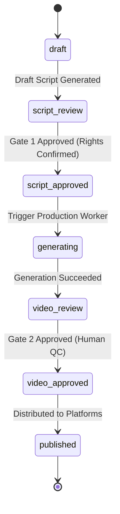

# Domain Core: `content_factory`

The `src/content_factory` package encapsulates the core business domain, data models, state machines, media intelligence, and AI execution engines for short-form video generation.

---

## Directory & Module Layout

### Contracts and shared helpers

| Module | Purpose |
| :--- | :--- |
| [`models/`](models) | **Pydantic Schemas**, split into one module per domain: `common`, `project`, `timeline`, `voice`, `research`, `script`, `agent`, `workflow`, `campaign`, `external`, `knowledge`, `history`, `media`. `models/__init__.py` re-exports the whole surface, so `from .models import Project` keeps working. |
| [`state.py`](state.py) | **Authoritative State Machine**: project states (`ProjectStatus`), allowable transitions, and transition conflict errors. |
| [`text.py`](text.py) | **Shared text helpers**: `normalize_title`, `slugify`, `tokenize`, `word_tokens`. Lexical search, smart-edit keywords and script copy-risk comparison delegate here; domain-specific timing tokenization remains separate. |
| [`config.py`](config.py) | **Configuration**: Pydantic `Settings` loading environment variables with the `CONTENT_FACTORY_` prefix and local `.env` fallbacks. |

### Service layer

| Module | Purpose |
| :--- | :--- |
| [`services/`](services) | **Service layer**, split into cohesive mixins over a shared `ServiceContext`: `context` (settings, store, lifecycle, background worker), `projects`, `research`, `scripting`, `styles`, `knowledge`, `agents`, `timeline`, `voice`, `media`, `media_tools`, `qa`, `seo`, `production`, `workflow`, `growth`, `history`, `resources`. |
| [`services/errors.py`](services/errors.py) | Domain errors (`NotFoundError`, `StateConflictError`, `RightsNotConfirmedError`) that the HTTP layer maps onto status codes. |
| [`service.py`](service.py) | **Compatibility facade** re-exporting `ContentFactoryService`, so existing imports keep working. New code should import `content_factory.services`. |

### Engines and pipelines

| Module | Purpose |
| :--- | :--- |
| [`script_engine.py`](script_engine.py) | **Script Drafting & Analysis**: built-in template provider, timing plan calculator, heuristic scoring, and style rule enforcement. |
| [`timeline.py`](timeline.py) | **NLE Timeline Engine**: scene splitting, ripple deletion, retiming, trimming, audio fades, markers, motion evaluation, and render-plan compilation. |
| [`nl_timeline.py`](nl_timeline.py) | **AI Co-Pilot Natural Language Timeline Parser**: bilingual (VI/EN) rule-based intent extraction (`parse_command`, `resolve_scene_index`, `apply_command`). |
| [`scenes.py`](scenes.py) | **Scene builder**: turns an approved script into an initial editable video project. |
| [`research.py`](research.py) | **Research Engine**: scores the curated reference library, assembles bundles, reconciles factual claims. |
| [`documents.py`](documents.py) | ** Federated document search** across public repositories with a zero-dependency lexical reranker. |
| [`rag.py`](rag.py) | **Knowledge engine**: template-driven chunking, hybrid (vector + BM25) retrieval with RRF fusion, citation grounding. |
| [`library.py`](library.py) | **Local library**: SQLite FTS5 index over downloaded documents. |
| [`media.py`](media.py), [`search.py`](search.py), [`dedup.py`](dedup.py) | **Media intelligence**: perceptual dHash deduplication, metadata inspection, semantic search over transcripts. |
| [`recook.py`](recook.py), [`ai_video_editor.py`](ai_video_editor.py) | **Re-cook pipeline** and the vision-driven AI video editor. |
| [`image_engine.py`](image_engine.py), [`voice_engine.py`](voice_engine.py), [`render.py`](render.py) | **Post-production**: Photoshop-style image operations, Audition-style speech chain, ffmpeg renderer. |
| [`tts.py`](tts.py), [`audio.py`](audio.py) | **Narration**: text-to-speech engines and audio analysis. |
| [`workflow.py`](workflow.py) | **DAG Workflow**: node-based pipeline orchestrator with topological execution and pre-flight checklist validation. Its `WorkflowService` protocol is the narrow slice of the service a run needs. |
| [`campaign.py`](campaign.py) | **Campaign Engine**: master pillar-to-micro asset synthesizer generating batch shorts and multi-platform packaging. |
| [`compliance.py`](compliance.py), [`audit.py`](audit.py), [`cost_guard.py`](cost_guard.py), [`virality.py`](virality.py) | **Quality gates**: platform rules, brand kit and copyright checks, provenance audit trail, cost guard, virality scoring. |
| [`perception.py`](perception.py), [`vision.py`](vision.py), [`thumbnail.py`](thumbnail.py) | **Perception layer**: audio/vision providers and thumbnail generation. |
| [`agent_bridge.py`](agent_bridge.py), [`agent_tools.py`](agent_tools.py) | **External AI agents**: Markdown contract briefs and the self-describing tool registry (`GET /tools`, `POST /tools/call`). |
| [`seo/`](seo) | **SEO engine**, split into focused modules: contracts, profiles, signals, scoring, optimisation, experiments, keywords and calibration. `from content_factory.seo import …` keeps working. |
| [`photo_compositor.py`](photo_compositor.py), [`map_generator.py`](map_generator.py), [`on_this_day.py`](on_this_day.py) | **Documentary graphics**: photo compositing, procedural SVG route maps and casualty infographics, and the 12-month disaster calendar. |
| [`perception.py`](perception.py) | **Audio perception**: `detect_silence_and_pace`, `classify_music_mood`, `check_audio_quality`. Implemented and tested, but **no router publishes it** — see *Unpublished engines* below. |
| [`hardware.py`](hardware.py), [`compute.py`](compute.py), [`resources.py`](resources.py), [`cache.py`](cache.py), [`resilience.py`](resilience.py), [`sandbox.py`](sandbox.py) | **Runtime**: GPU discovery and admission control, content-addressed caching, retry/rate-limit policies, sandboxing. |
| [`fusion_graph.py`](fusion_graph.py) | **Fusion compositor graph** (newest module; currently the largest source of type errors). |

---

## Unpublished engines

A few engines are implemented and covered by tests, but nothing exposes them over HTTP, so no client can call them. The Next.js studio now says so on-screen rather than displaying invented readings (`frontend/src/components/audio/AudioLabStudio.tsx`):

| Module | Capability | Missing route |
| :--- | :--- | :--- |
| `perception.py` | Silence and pace detection, music-mood/BPM classification, loudness and true-peak measurement | e.g. `POST /audio/perception/*` |
| `audio.py` | `duck_music_under_speech`, `duck_music` | e.g. `POST /audio/duck` (the mixing functions have no route; `qa.py`'s `render/duck` is a different path) |
| — | Stem splitting (vocals/music/drums/bass) | e.g. `POST /audio/stems` |
| `audio.py::ffmpeg_binary` | Resolving `ffmpeg` | It only checks `PATH`, so a bundled `imageio_ffmpeg` binary goes unused and 11 tests fail |

---

## Current gate status

`mypy src` reports **43 errors across 7 files** out of 129 checked. They cluster in the newest modules:

```text
fusion_graph.py, photo_compositor.py, media_tools.py, hardware.py,
models/audio.py, models/captions.py, models/export_qc.py
```

`ruff check` reports 242 findings. `tests/test_architecture.py` still passes — the module-line budget, disjoint-mixin and reachable-method guards are intact; the failures are type and style, not structure.

## Authoritative Lifecycle



### Safety Constraints
- AI agents cannot confirm source rights (`source_rights_confirmed` must be explicitly asserted by the human operator).
- `assert_transition()` in `state.py` raises `StateMachineError`, which the service layer
  re-raises as `StateConflictError` so the HTTP layer can answer 409.

### Refactored backend boundaries

- `seo/` replaces the monolithic SEO engine with contracts, profiles, signals,
  scoring, optimization, experiments, keywords and calibration modules. Existing
  imports through `content_factory.seo` remain available. All implementation
  modules use the standard 1,100-line budget; registry exceptions are path-specific.
- `models/qa.py` owns QA requests; `services/qa.py` owns orchestration. The HTTP
  router delegates without constructing search, audit or production engines.
- Timeline operations, rebuild, AI assist, text polish and voice duration sync
  share normalization and server-owned revisions. Working copies prevent failed
  edits from mutating stored objects. Initial build/rebuild retains its previous
  policy and does not change lifecycle state or approve content.
- Voice synthesis stages audio per generation and rejects stale results when the
  timeline, language or narration bundle changes. Failed runs preserve previous
  audio; legacy flat audio paths remain readable.
- Remaining limitations: comparison and save are not an atomic transaction;
  old audio generations need a retention policy. QA search still rebuilds its
  index per request. These are follow-up work, not guarantees of this refactor.

### Adding to the service layer
1. Pick the mixin whose domain the operation belongs to (or add a new module under
   `services/` and register it in `services/__init__.py`).
2. If the operation calls another layer, add that layer to the mixin's base list — never
   reach across the composition implicitly.
3. Run `pytest tests/test_architecture.py`; it enforces disjoint mixins, reachable
   methods, and the module size budget.
